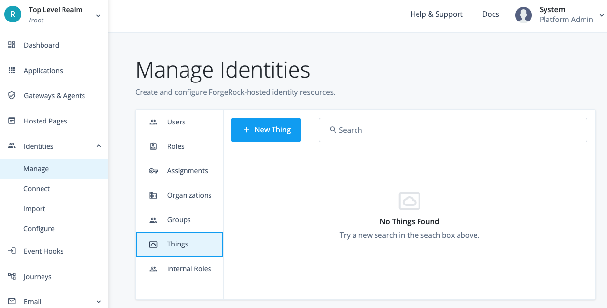
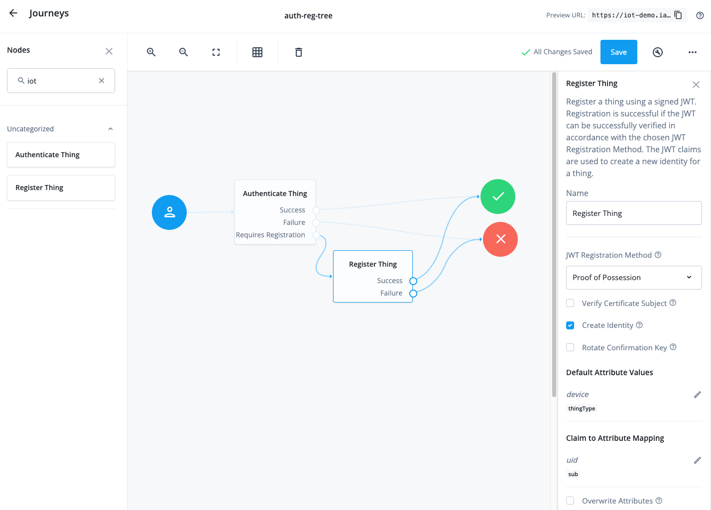

# How to deploy ForgeOps for IoT

This guide will walk you through the steps of enabling IoT on a ForgeOps deployment. It will assume that you are
familiar with [ForgeOps](https://backstage.forgerock.com/docs/forgeops/7.3/index.html)
and [ForgeRock IoT](https://backstage.forgerock.com/docs/iot).

## Deploy ForgeOps

Deploy the ForgeOps Cloud Developer's Kit (CDK) as described in the
[ForgeOps documentation](https://backstage.forgerock.com/docs/forgeops/7.3/cdk/overview.html). This guide was prepared
with a CDK deployment on Google Kubernetes Engine.

## Configure the deployment for IoT

Set a variable to your ForgeOps directory to be used later:
```
export FORGEOPS_DIR=/path/to/forgeops
```

Clone the `iot-edge` Git repository:
```
git clone https://github.com/ForgeRock/iot-edge.git
```

Set a variable to your `iot-edge` repo directory to be used later:
```
export IOTEDGE_DIR=/path/to/iot-edge
```

### Apply DS Schema

Apply the default LDAP schema for _things_. The `thingType` and `thingKeys` attributes are required for the IoT
authentication nodes to function successfully. The rest of the attributes are optional and adding them will depend on
your individual use case. You may add any additional attributes as required by your use case.

```
kubectl exec ds-idrepo-0 -- /bin/bash -c "ldapmodify \
    --hostname localhost \
    --port 1636 \
    --useSsl \
    --bindDN uid=admin \
    --bindPassword $(cat $DS_UID_ADMIN_PASSWORD_FILE) \
    --trustAll <<EOF
dn: cn=schema
changetype: modify
add: attributeTypes
attributeTypes: ( 1.3.6.1.4.1.36733.2.2.1.20 NAME 'thingType' DESC 'Type of a thing (e.g. device, service or gateway)' SYNTAX 1.3.6.1.4.1.1466.115.121.1.15 X-ORIGIN 'OpenAM' )
attributeTypes: ( 1.3.6.1.4.1.36733.2.2.1.21 NAME 'thingKeys' DESC 'JWKS containing the various keys used by things' SYNTAX 1.3.6.1.4.1.1466.115.121.1.15 X-ORIGIN 'OpenAM' )
attributeTypes: ( 1.3.6.1.4.1.36733.2.2.1.22 NAME 'thingOAuth2ClientName' DESC 'OAuth 2.0 client associated with the thing' SYNTAX 1.3.6.1.4.1.1466.115.121.1.15 X-ORIGIN 'OpenAM' )
attributeTypes: ( 1.3.6.1.4.1.36733.2.2.1.23 NAME 'thingConfig' DESC 'Configuration for things' SYNTAX 1.3.6.1.4.1.1466.115.121.1.15 X-ORIGIN 'OpenAM' )
attributeTypes: ( 1.3.6.1.4.1.36733.2.2.1.24 NAME 'thingProperties' DESC 'Properties of things' SYNTAX 1.3.6.1.4.1.1466.115.121.1.15 X-ORIGIN 'OpenAM' )
attributeTypes: ( 1.3.6.1.4.1.36733.2.2.1.27 NAME 'fr-idm-managed-thing-custom-attrs' EQUALITY caseIgnoreJsonQueryMatch SYNTAX 1.3.6.1.4.1.36733.2.1.3.1 SINGLE-VALUE X-STABILITY 'Internal' X-ORIGIN 'OpenAM' )
-
add: objectClasses
objectClasses: ( 1.3.6.1.4.1.36733.2.2.2.20 NAME 'fr-iot' DESC 'Auxiliary class for ForgeRock IoT Identity attributes' SUP top AUXILIARY MAY ( thingType $ thingKeys $ thingOAuth2ClientName $ thingConfig $ thingProperties $ fr-idm-managed-thing-custom-attrs ) X-ORIGIN 'OpenAM' )
EOF"
```

### Apply IDM configuration

In order to create _thing_ identities we need to configure a new IDM managed object for _things_. The following files
contain additional configuration to achieve this:
- `{IOTEDGE_DIR}/deployments/forgeops/overlay/docker/idm/config-profiles/cdk/conf/repo.ds.json` - IDM to DS mapping for _thing_ identity attributes.
- `{IOTEDGE_DIR}/deployments/forgeops/overlay/docker/idm/config-profiles/cdk/conf/managed.json` - Managed object configuration for _things_.
- `{IOTEDGE_DIR}/deployments/forgeops/overlay/docker/idm/config-profiles/cdk/conf/internal.json` - User and _thing_ relationship configuration.

As with the DS schema, the IDM configuration only contains the default example attributes and may require further
modification based on your individual use case.

Copy the files to your ForgeOps directory:
```
cp "$IOTEDGE_DIR"/deployments/forgeops/overlay/docker/idm/config-profiles/cdk/conf/* "$FORGEOPS_DIR"/docker/idm/config-profiles/cdk/conf
```

We need to rebuild the IDM docker image in order to apply the configuration. Familiarise yourself with the
[Docker Image Development for IDM](https://backstage.forgerock.com/docs/forgeops/7.3/cdk/develop/idm.html) before proceeding.

You may also need to modify you IDM docker file depending on your build and target environment.
For example, if you are building on an M1 Mac and deploying to GKE uo might need to modify
`{IOTEDGE_DIR}/deployments/forgeops/tmp/forgeops/docker/idm/Dockerfile` as follows:
```
FROM --platform=linux/amd64 gcr.io/forgerock-io/idm-cdk:7.3.0
```

Rebuild and install the IDM image:
```
"$FORGEOPS_DIR"/bin/forgeops build idm --config-profile cdk --push-to {my-repo}
"$FORGEOPS_DIR"/bin/forgeops delete idm -y
"$FORGEOPS_DIR"/bin/forgeops install idm --cdk
```

You should now see the _Things_ identity in the platform UI. Test the configuration by creating a new _Thing_:



### Configure AM

Note that any configuration changes made at runtime will be lost when AM is restarted. Follow the
[Docker Image Development for AM](https://backstage.forgerock.com/docs/forgeops/7.3/cdk/develop/am.html) guide
to make the changes permanent.

#### Prerequisites for all use cases

 - Add an IoT service
   - Enable Create OAuth 2.0 Client
   - Enable Create OAuth 2.0 JWT Issuer
 - Add `am.services.iot.jwt.issuer.signing` with `hmacsigningtest` mapping to the default keystore
 - Modify OAuth2 Provider service
   - Grant Types: `JWT Bearer`

#### Authentication Journeys

Create a new Journey:
  - Name : `auth-reg-tree`
  - Identity Object : `managed/thing`

Add the _Authenticate Thing_ and _Register Thing_ nodes:

 - Authenticate Thing node
   - JWT Authentication Method : `Proof of Possession`
   - Issue Restricted Token : `enabled`

 - Register Thing node
   - JWT Registration Method : `Proof of Possession`
   - Create Identity : enabled
   - Default Attribute Values : Key = `thingType`, Value = `device`;
   - Claim to Attribute Mapping : Key = `sub`, Value = `uid`;



### Test the deployment using the IoT SDK

Download and install [Go](https://go.dev/), version 1.19 or later.

Run the IoT SDK example to dynamically register a _thing_ and request an access token for it:
```
cd "$IOTEDGE_DIR"
./run.sh example "thing/dynamic-registration/pop" \
   -name "dynamic-thing" \
   -url "https://iot-demo.iam.forgeops.com/am" \
   -tree "auth-reg-tree"
```

If the registration was successful then you should see the following in the console:
```
Creating Thing dynamic-thing... Done
Requesting access token... Done
Access token: Jyn3F9Z0Lv_t-viH4xr1jc-OKzI
Expires in: 3599
Scope(s): [publish]
```
