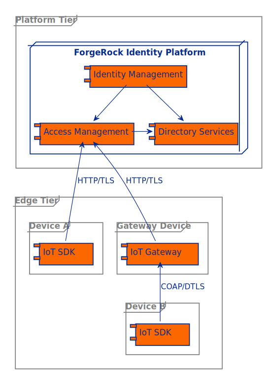
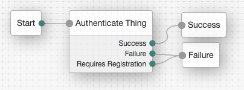
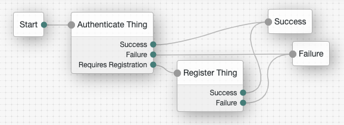

# Getting Started

This document outlines how to set up ForgeRock Access Management (AM) for the IoT and run the SDK example 
programs. The SDK examples can communicate directly with AM or via the Thing Gateway.



## Prerequisites

- [Docker](https://docs.docker.com/engine/install/)
- [Go](https://golang.org/doc/install)

## Run and Configure AM

Get the latest AM image,

```bash
docker pull gcr.io/forgerock-io/am/docker-build:latest
```

and run it:

```bash
docker run --name am --rm -ti \
    -e AM_ADMIN_PWD=password \
    -e TOMCAT_INSECURE=ENABLED \
    -p 8080:8080 \
    gcr.io/forgerock-io/am/docker-build:latest
```

Once the AM installation has completed, log in to http://am.localtest.me:8080/am with `amadmin`:`password`.

Go to [Services](http://am.localtest.me:8080/am/ui-admin/#realms/%2F/services):

- Add the _IoT Service_
- Select _Create OAuth 2.0 Client_ and _Create OAuth 2.0 JWT Issuer_
- Save Changes
- Add the _OAuth2 Provider_ service

Go to the [IoT OAuth 2.0 Client](http://am.localtest.me:8080/am/ui-admin/#realms/%2F/applications-oauth2-clients/clients/edit/forgerock-iot-oauth2-client):

- Add `publish` to _Scope(s)_
- Save Changes

Create an [authentication tree](http://am.localtest.me:8080/am/ui-admin/#realms/%2F/authentication-trees) called `auth-tree`:



Create a second authentication tree called
`reg-tree` and enable _Create Identity_ for the _Register Thing_ node:



Go to the [default keystore mappings](http://am.localtest.me:8080/am/ui-admin/#configure/secretStores/KeyStoreSecretStore/edit/default-keystore)
and add the mapping: _Secret ID_: `am.services.iot.cert.verification`, _Alias_: `es256test`. The CA certificate used in
this example is one of the test certificates (es256test) that AM includes by default. This mapping tells the
_Register Thing_ node what key to use when verifying the registration certificate.

Use curl and AM's REST endpoints to preregistered two identities that can be used in the authentication only examples. Get an admin SSO token:

```bash
curl --request POST 'http://am.localtest.me:8080/am/json/authenticate' \
--header 'Content-Type: application/json' \
--header 'X-OpenAM-Username: amadmin' \
--header 'X-OpenAM-Password: password' \
--header 'Accept-API-Version: resource=2.0, protocol=1.0'
```

Save the `tokenId` received from this request to a variable:

```bash
tokenId="5oXAB6....lMxAAA.*"
```

Create the
`simple-thing` identity:

```bash
curl -v --request PUT 'http://am.localtest.me:8080/am/json/realms/root/users/simple-thing' \
--header 'Content-Type: application/json' \
--header 'Accept-Api-Version: resource=4.0, protocol=2.1' \
--cookie "iPlanetDirectoryPro=${tokenId}" \
--data '{
    "userPassword": "generated-password",
    "thingType": "device",
    "thingKeys": "{\"keys\":[{\"use\":\"sig\",\"kty\":\"EC\",\"kid\":\"pop.cnf\",\"crv\":\"P-256\",\"alg\":\"ES256\",\"x\":\"wjC9kMzwIeXNn6lsjdqplcq9aCWpAOZ0af1_yruCcJ4\",\"y\":\"ihIziCymBnU8W8m5zx69DsQr0sWDiXsDMq04lBmfEHw\"}]}"
}'
```

Create the `simple-gateway` identity:

```bash
curl -v --request PUT 'http://am.localtest.me:8080/am/json/realms/root/users/simple-gateway' \
--header 'Content-Type: application/json' \
--header 'Accept-Api-Version: resource=4.0, protocol=2.1' \
--cookie "iPlanetDirectoryPro=${tokenId}" \
--data '{
    "userPassword": "generated-password",
    "thingType": "gateway",
    "thingKeys": "{\"keys\":[{\"use\":\"sig\",\"kty\":\"EC\",\"kid\":\"pop.cnf\",\"crv\":\"P-256\",\"alg\":\"ES256\",\"x\":\"wjC9kMzwIeXNn6lsjdqplcq9aCWpAOZ0af1_yruCcJ4\",\"y\":\"ihIziCymBnU8W8m5zx69DsQr0sWDiXsDMq04lBmfEHw\"}]}"
}'
```

## Get the example code

Clone this repository
```bash
git clone git@github.com:ForgeRock/iot-edge.git
```

and change directory to the repository root:

```bash
cd iot-edge
```

## Run the SDK examples connecting direct to AM

### Simple Example

The simple example will authenticate and request an access token for the thing. It requires the thing to be in
possession of an asymmetric key pair for signing and have a preregistered identity.

Run the [simple example](https://github.com/ForgeRock/iot-edge/blob/master/examples/thing/simple/main.go):
```bash
./run.sh example "thing/simple" \
    -name "simple-thing" \
    -url "http://am.localtest.me:8080/am" \
    -realm "/" \
    -tree "auth-tree" \
    -keyfile "./examples/resources/eckey1.key.pem"
```

### Register with Certificate Example

The registration example will create a new identity, authenticate and request an access token for the thing. It requires
the thing to be in possession of an asymmetric key pair for signing and a CA signed X.509 certificate containing the
key pair's public key.

Run the [registration example](https://github.com/ForgeRock/iot-edge/blob/master/examples/thing/cert-registration/main.go):
```bash
./run.sh example "thing/cert-registration" \
    -name "dynamic-thing" \
    -url "http://am.localtest.me:8080/am" \
    -realm "/" \
    -tree "reg-tree" \
    -keyfile "./examples/resources/eckey1.key.pem" \
    -certfile "./examples/resources/dynamic-thing.cert.pem"
```

## Run the SDK examples connecting to AM via the Thing Gateway

The [Gateway](https://github.com/ForgeRock/iot-edge/blob/master/cmd/gateway/main.go) has its own identity in AM, which similar to a Thing, can be preregistered or dynamically created on its first authenication. In *authentication* mode, the gateway requires an asymmetric key pair for signing and to have a preregistered identity in AM. In *registration* mode, the gateway can registered itself if its in possession of an asymmetric key pair for signing and a CA signed X.509 certificate containing the
key pair's public key. 

### Simple Example via the Gateway

Run the Gateway in *authentication* mode:

```bash
./run.sh gateway \
    --name "simple-gateway" \
    --url "http://am.localtest.me:8080/am" \
    --realm "/" \
    --tree "auth-tree" \
    --kid "pop.cnf" \
    --key "./examples/resources/eckey1.key.pem" \
    --address ":5683" \
    -d
```

The message `Thing Gateway server started` will appear if the `simple-gateway` has started up and authenticated itself successfully.

In a different terminal window, run the SDK [simple example](https://github.com/ForgeRock/iot-edge/blob/master/examples/thing/simple/main.go) to connect a thing to AM via the `simple-gateway`:

```bash
./run.sh example "thing/simple" \
    -name "simple-thing" \
    -url "coap://:5683" \
    -keyfile "./examples/resources/eckey1.key.pem"
```

### Register with Certificate Example via the Gateway

Run the Gateway in *registration* mode::

```bash
./run.sh gateway \
    --name "dynamic-gateway" \
    --url "http://am.localtest.me:8080/am" \
    --realm "/" \
    --tree "reg-tree" \
    --key "./examples/resources/eckey1.key.pem" \
    --cert "./examples/resources/dynamic-gateway.cert.pem" \
    --address ":5683" \
    -d
```

The message `Thing Gateway server started` will appear if the Gateway has started up, registered and authenticated itself successfully.

In a different terminal window, run the SDK [registration example](https://github.com/ForgeRock/iot-edge/blob/master/examples/thing/cert-registration/main.go) to connect a Thing to AM via the `dynamic-gateway`:

```bash
./run.sh example "thing/cert-registration" \
    -name "dynamic-thing" \
    -url "coap://:5683" \
    -keyfile "./examples/resources/eckey1.key.pem" \
    -certfile "./examples/resources/dynamic-thing.cert.pem"
```
