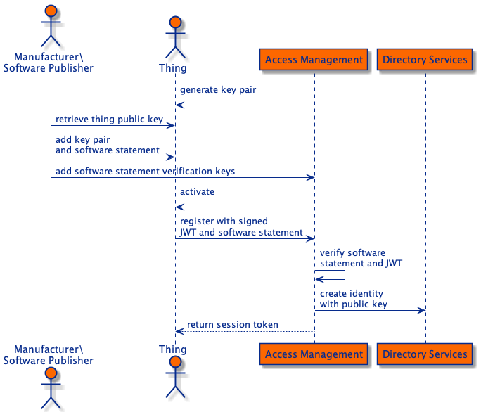

# Getting Started

## Introduction


### IoT SDK

The _IoT SDK_ enables a _thing_, which can be either a physical _device_ or a software _service_, to register and
authenticate without human interaction. Once registered, the _thing_ will be represented by a digital identity in the
ForgeRock Identity Platform and can authenticate itself in order to interact with the platform tier. The IoT SDK
can communicate directly with the platform using HTTP(S) or via the IoT Gateway using CoAP(S).

### IoT Gateway
The _IoT Gateway_ is an application that enables more constrained devices to interact with the ForgeRock Identity
Platform by acting as a proxy between a _thing_ and the Platform.

## Evaluate ForgeRock IoT

This section covers the tasks you need to quickly get a test or demo environment running. It will guide you through
configuring ForgeRock Access Management (AM) and running the IoT SDK and Gateway examples.

### Install prerequisite software

The IoT SDK and Gateway has been developed in the Go programming language and to run the examples you require
[Go 1.15 or later](https://golang.org/doc/install).

You also require [Git](https://git-scm.com/) for downloading the source code and running the examples.  

### Get the example code

Clone this repository:
```bash
git clone git@github.com:ForgeRock/iot-edge.git
```

This will create a directory named `iot-edge`. The instructions for running the examples will assume this as your
current directory:

```bash
cd iot-edge
```

### Install and configure AM

The examples require AM to be installed with a fully qualified domain name of `am.localtest.me`, using port `8080`.
Follow the [AM Evaluation Guide](https://backstage.forgerock.com/docs/am/7.1/eval-guide/) to quickly set up an instance.

Log in to AM and go to [Services](http://am.localtest.me:8080/am/ui-admin/#realms/%2F/services):

- Add the _IoT Service_
- Select _Create OAuth 2.0 Client_ and _Create OAuth 2.0 JWT Issuer_
- Save Changes
- Add the _OAuth2 Provider_ service

Go to the [IoT OAuth 2.0 Client](http://am.localtest.me:8080/am/ui-admin/#realms/%2F/applications-oauth2-clients/clients/edit/forgerock-iot-oauth2-client):

- Add `publish` and `subscribe` to _Scope(s)_
- Save Changes

Create the follow [authentication trees](http://am.localtest.me:8080/am/ui-admin/#realms/%2F/authentication-trees).

Authentication only called `auth-tree`:


Registration and authentication called `reg-tree`:


Registration only called `oauth2-reg-tree`:


Each SDK example will modify the configuration of the nodes as required.

Go to the [default keystore mappings](http://am.localtest.me:8080/am/ui-admin/#configure/secretStores/KeyStoreSecretStore/edit/default-keystore)
and add the mapping: _Secret ID_: `am.services.iot.cert.verification`, _Alias_: `es256test`. The CA certificate used in
this example is one of the test certificates (es256test) that AM includes by default. This mapping tells the
_Register Thing_ node what key to use when verifying the registration certificate.

Create a [Software Publisher Agent](http://am.localtest.me:8080/am/ui-admin/#realms/%2F/applications-oauth2-softwarePublisher)
with the following settings:
- Agent ID: `iot-software-publisher`
- Software publisher issuer: `https://soft-pub.example.com`
- Software statement signing Algorithm: `ES256`
- Public key selector: `JWKs`
- Json Web Key: `{"keys": [{"use":"sig","kty":"EC","kid":"gLcQhotEZygUuVUrt3Z6azql3dVfqQS7lo3vereyU7Y=","crv":"P-256","alg":"ES256","x":"IUuXjru5zb3ixx23uM-qYsFX47eQNWJ6jTkHudFpVr4","y":"VDSoP-7XBc8KLSeVb2fwzg36458AV3a8MrBx1RZHNho"}]}`

### Run the IoT SDK examples

#### Manual Registration


This example will authenticate and request an access token for the thing. It requires the thing to be in possession
of an asymmetric key pair for signing.

Before running the example, [register the thing manually](getting-started.md#register-identity) using `manual-thing` as
the thing's ID.

In `auth-tree` apply the following configuration:
- On the _Authenticate Thing_ node
  - Set _JWT Authentication Method_ to `Proof of Possession`
  - Enable _Issue Restricted Token_

Run the [example](../examples/thing/manual-registration/main.go):
```bash
./run.sh example "thing/manual-registration" \
    -name "manual-thing" \
    -url "http://am.localtest.me:8080/am" \
    -tree "auth-tree"
```

For more information, see the [Authenticate Thing node documentation](iot-authentication-nodes.md#authenticate-thing-node).

#### Dynamic Registration
Dynamic registration allows a thing to create a new identity without human interaction. The _Register Thing_ node
supports multiple registration methods and the following examples demonstrates how to use them.

##### Proof of Possession & Certificate


This example will create a new identity, authenticate and request an access token for the thing. It requires the thing
to be in possession of an asymmetric key pair for signing, and a CA signed X.509 certificate containing the key pair's
public key.

In `reg-tree` apply the following configuration:
- On the _Authenticate Thing_ node
    - Set _JWT Authentication Method_ to `Proof of Possession`
    - Enable _Issue Restricted Token_
- On the _Register Thing_ node
  - Set _JWT Registration Method_ to `Proof of Possession & Certificate`
  - Enable _Create Identity_

Run the [example](../examples/thing/dynamic-registration/pop-cert/main.go):
```bash
./run.sh example "thing/dynamic-registration/pop-cert" \
    -name "dynamic-pop-cert-thing" \
    -url "http://am.localtest.me:8080/am" \
    -tree "reg-tree"
```

For more information, see the [Register Thing node documentation](iot-authentication-nodes.md#pop-cert-reg).

##### Proof of Possession & Software Statement


This example will create a new identity, authenticate and request an access token for the thing. It requires the thing
to be in possession of an asymmetric key pair for signing, and a [Software Statement](https://datatracker.ietf.org/doc/html/rfc7591#section-2.3)
containing the key pair's public key in the `jwks` claim.

In `reg-tree` apply the following configuration:
- On the _Authenticate Thing_ node
    - Set _JWT Authentication Method_ to `Proof of Possession`
    - Enable _Issue Restricted Token_
- On the _Register Thing_ node
  - Set _JWT Registration Method_ to `Proof of Possession & Software Statement`
  - Enable _Create Identity_

Run the [example](../examples/thing/dynamic-registration/pop-sw-stmt/main.go):
```bash
./run.sh example "thing/dynamic-registration/pop-sw-stmt" \
    -name "dynamic-pop-sw-stmt-thing" \
    -url "http://am.localtest.me:8080/am" \
    -tree "reg-tree"
```

For more information, see the [Register Thing node documentation](iot-authentication-nodes.md#pop-sw-stmt-reg).

##### Software Statement


This example will create a new identity with a unique ID. The ID will be retrieved after registration and then used to
authenticate the thing. Once authenticated, an access token will be requested for the thing. This flow mimics
[OAuth 2.0 Dynamic Registration](https://datatracker.ietf.org/doc/html/rfc7591) and
[OAuth 2.0 JWT Bearer Authentication](https://datatracker.ietf.org/doc/html/rfc7523) to request an access token via a 
standard API.

It requires the thing to be in possession of an asymmetric key pair for signing, and a
[Software Statement](https://datatracker.ietf.org/doc/html/rfc7591#section-2.3) containing the key pair's public key
in the `jwks` claim.

In `oauth2-reg-tree` apply the following configuration:
- On the _Register Thing_ node
  - Set _JWT Registration Method_ to `Software Statement`
  - Enable _Create Identity_
  - Add `thingType` as key and `device` as value to _Default Attribute Values_

In `auth-tree` apply the following configuration:
- On the _Authenticate Thing_ node
  - Set _JWT Authentication Method_ to `Client Assertion`
  - Disable _Issue Restricted Token_

Run the [example](../examples/thing/dynamic-registration/sw-stmt/main.go):
```bash
./run.sh example "thing/dynamic-registration/sw-stmt" \
    -url "http://am.localtest.me:8080/am" \
    -audience "http://am.localtest.me:8080/am/oauth2/access_token" \
    -reg-tree "oauth2-reg-tree" \
    -auth-tree "auth-tree"
```

For more information, see the [Register Thing node documentation](iot-authentication-nodes.md#sw-stmt-reg).

##### Proof of Possession


This example will create a new identity, authenticate and request an access token for the thing. It requires the thing
to be in possession of an asymmetric key pair for signing. This registration method should only be used when the thing
registering is already trusted as no trusted third party is used in this flow.

In `reg-tree` apply the following configuration:
- On the _Authenticate Thing_ node
  - Set _JWT Authentication Method_ to `Proof of Possession`
  - Enable _Issue Restricted Token_
- On the _Register Thing_ node
  - Set _JWT Registration Method_ to `Proof of Possession`
  - Enable _Create Identity_

Run the [example](../examples/thing/dynamic-registration/pop/main.go):
```bash
./run.sh example "thing/dynamic-registration/pop" \
    -name "dynamic-pop-thing" \
    -url "http://am.localtest.me:8080/am" \
    -tree "reg-tree"
```

For more information, see the [Register Thing node documentation](iot-authentication-nodes.md#pop-reg).

#### User Token Request

</br>

This example will create a new identity for a thing using dynamic registration and authenticate it. Once authenticated,
it will request a user access token using the OAuth 2.0 Device Authorization Grant. This access token authorizes the
thing to access a user's resources, or act on behalf of the user, as specified by the scope granted by the user. The
example demonstrates how the thing can manage the access token's lifecycle by introspecting and refreshing the token.

Requesting a user token requires a user to be registered and authenticated before approving the request. Upon
running the example the user will be given a URL to go to in order to perform the authorization.

In `reg-tree` apply the following configuration:
- On the _Authenticate Thing_ node
  - Set _JWT Authentication Method_ to `Proof of Possession`
  - Enable _Issue Restricted Token_
- On the _Register Thing_ node
  - Set _JWT Registration Method_ to `Proof of Possession & Certificate`
  - Enable _Create Identity_

Run the [example](../examples/thing/user-token/main.go):
```bash
./run.sh example "thing/user-token" \
    -name "user-authorized-thing" \
    -url "http://am.localtest.me:8080/am" \
    -tree "reg-tree"
```

### Run the IoT Gateway examples

The [IoT Gateway](https://github.com/ForgeRock/iot-edge/blob/master/cmd/gateway/main.go) has its own identity in AM,
which similar to a Thing, can be manually or dynamically registered. When manually registered, the gateway requires an
asymmetric key pair for signing. When dynamically registered, the gateway requires an asymmetric key pair for signing,
and a CA signed X.509 certificate containing the key pair's public key. 

#### Manual Registration

This example will start the gateway and authenticate it.

Before running the example, [register the gateway manually](getting-started.md#register-identity) using `manual-gateway`
as the gateway's ID.

In `auth-tree` apply the following configuration:
- On the _Authenticate Thing_ node
  - Set _JWT Authentication Method_ to `Proof of Possession`
  - Enable _Issue Restricted Token_

Run the gateway:

```bash
./run.sh gateway \
    --name "manual-gateway" \
    --url "http://am.localtest.me:8080/am" \
    --audience "/" \
    --realm "/" \
    --tree "auth-tree" \
    --kid "cbnztC8J_l2feNf0aTFBDDQJuvrd2JbLPoOAxHR2N8o=" \
    --key "../../examples/resources/eckey1.key.pem" \
    --address ":5683" \
    -d
```

The message `IoT Gateway server started` will appear if the `manual-gateway` has started up and authenticated itself
successfully.

In a different terminal window, [connect a thing to the gateway](getting-started.md#connect-to-gateway).

To stop the gateway process, press `Ctrl+C` in the window where the process is running.

#### Dynamic Registration

This example will start the gateway, register and authenticate it.

Run the gateway:

```bash
./run.sh gateway \
    --name "dynamic-gateway" \
    --url "http://am.localtest.me:8080/am" \
    --audience "/" \
    --realm "/" \
    --tree "reg-tree" \
    --key "../../examples/resources/eckey1.key.pem" \
    --cert "../../examples/resources/dynamic-gateway.cert.pem" \
    --address ":5683" \
    -d
```

The message `IoT Gateway server started` will appear if the gateway has started up, registered and authenticated
itself successfully.

In a different terminal window, [connect a thing to the gateway](getting-started.md#connect-to-gateway).

To stop the gateway process, press `Ctrl+C` in the window where the process is running.

#### Connect to the IoT Gateway <a name="connect-to-gateway"></a>

This example will connect a thing to the IoT Gateway. Once the thing has connected it will authenticate and request
an access token.

Before running the example, [register the thing manually](getting-started.md#register-identity) using `gateway-thing`
as the thing's ID.

Run the SDK [example](../examples/thing/manual-registration/main.go)
to connect the thing to the gateway:

```bash
./run.sh example "thing/manual-registration" \
    -name "gateway-thing" \
    -url "coap://:5683"
```

### Register Identity

Use curl and AM's REST endpoints to manually register an identity for a thing or the gateway.

Get an admin SSO token:

```bash
curl --request POST 'http://am.localtest.me:8080/am/json/authenticate' \
--header 'Content-Type: application/json' \
--header 'X-OpenAM-Username: amAdmin' \
--header 'X-OpenAM-Password: changeit' \
--header 'Accept-API-Version: resource=2.0, protocol=1.0'
```

Save the `tokenId` received from this request to a variable:

```bash
tokenId="5oXAB6....lMxAAA.*"
```

Set the ID of the identity to register. Change the value as specified in the example's instructions:

```bash
ID=thing-or-gateway
```

Register an identity for a thing:

```bash
curl -v --request PUT "http://am.localtest.me:8080/am/json/realms/root/users/${ID}" \
--header 'Content-Type: application/json' \
--header 'Accept-Api-Version: resource=4.0, protocol=2.1' \
--cookie "iPlanetDirectoryPro=${tokenId}" \
--data '{
    "userPassword": "5tr0ngG3n3r@ted",
    "thingType": "device",
    "thingKeys": "{\"keys\":[{\"use\":\"sig\",\"kty\":\"EC\",\"kid\":\"cbnztC8J_l2feNf0aTFBDDQJuvrd2JbLPoOAxHR2N8o=\",\"crv\":\"P-256\",\"alg\":\"ES256\",\"x\":\"wjC9kMzwIeXNn6lsjdqplcq9aCWpAOZ0af1_yruCcJ4\",\"y\":\"ihIziCymBnU8W8m5zx69DsQr0sWDiXsDMq04lBmfEHw\"}]}"
}'
```

Register an identity for the gateway:

```bash
curl -v --request PUT "http://am.localtest.me:8080/am/json/realms/root/users/${ID}" \
--header 'Content-Type: application/json' \
--header 'Accept-Api-Version: resource=4.0, protocol=2.1' \
--cookie "iPlanetDirectoryPro=${tokenId}" \
--data '{
    "userPassword": "5tr0ngG3n3r@ted",
    "thingType": "gateway",
    "thingKeys": "{\"keys\":[{\"use\":\"sig\",\"kty\":\"EC\",\"kid\":\"cbnztC8J_l2feNf0aTFBDDQJuvrd2JbLPoOAxHR2N8o=\",\"crv\":\"P-256\",\"alg\":\"ES256\",\"x\":\"wjC9kMzwIeXNn6lsjdqplcq9aCWpAOZ0af1_yruCcJ4\",\"y\":\"ihIziCymBnU8W8m5zx69DsQr0sWDiXsDMq04lBmfEHw\"}]}"
}'
```

## Next Steps

#### [Develop a client application with the IoT SDK](develop-a-client-application.md)

#### [Build the IoT Gateway for your target system](building-the-gateway.md)
