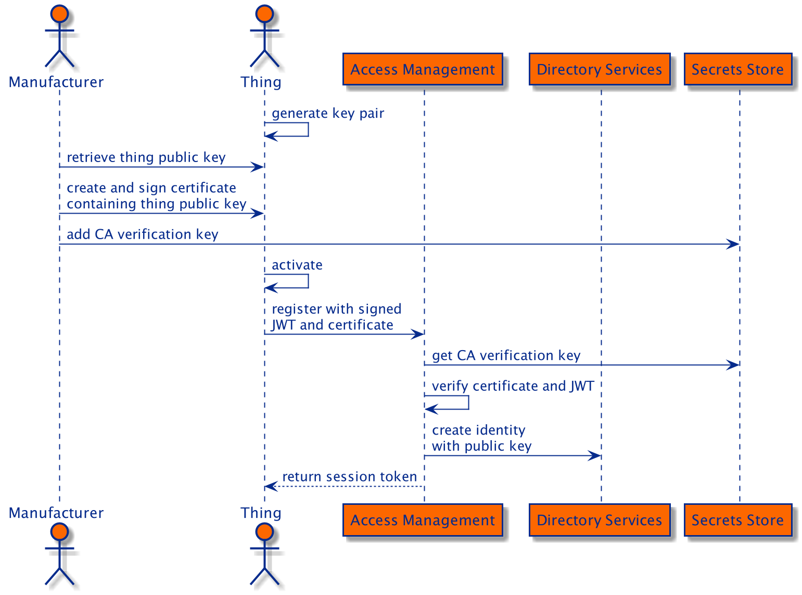

# IoT Use Cases

This document outlines how the ForgeRock Platform and IoT edge components can be used to solve different IoT use cases.

## Use Case 1: Manual Registration
The thing's identity is created manually before the thing is activated and it authenticates using Access
Management's _Authenticate Thing_ Node.

## Use Case 2: Dynamic Registration
The thing's identity is created dynamically when the thing is activated and it registers using Access
Management's _Register Thing_ Node.

## Use Case 3: Platform Tier Authorisation with OAuth 2.0

## Use Case 4: Edge Tier Authorisation with OAuth 2.0

## Use Case 5: Constrained Devices
In the following diagram the device classification in [RFC-7228](https://tools.ietf.org/html/rfc7228#section-3) is used
to demonstrate how devices with different network capabilities may use the IoT SDK and IoT Gateway.

 - Class 0 device: very constrained with no internet capability and requires a gateway.
 - Class 1 device: quite constrained and supports CoAP with DTLS over UDP.
 - Class 2 device: less constrained and supports HTTP with TLS.
