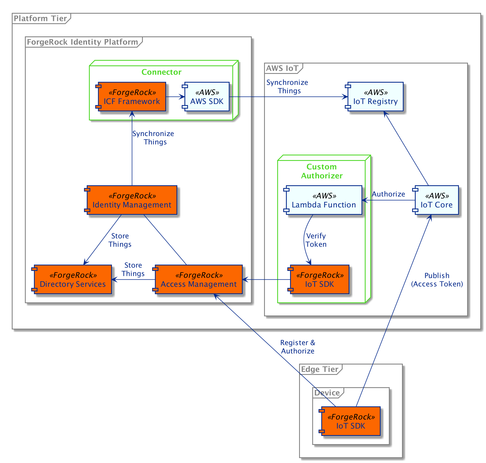
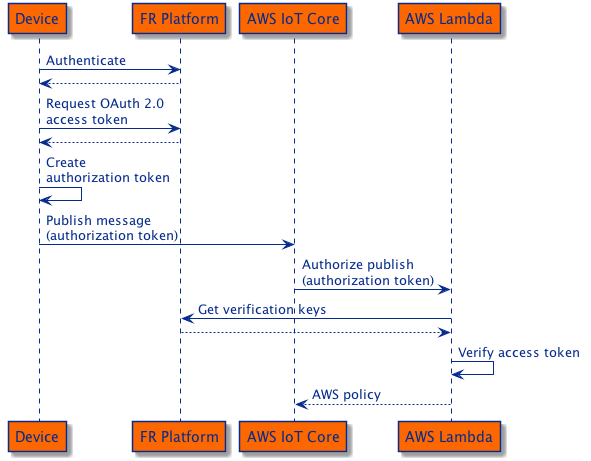

## AWS IoT Integration

The ForgeRock Platform can be used for identity management, authentication and authorization of devices
when deployed alongside AWS IoT. AWS IoT Core offers a custom mechanism by which devices can be authenticated
and authorized before being allowed to publish or subscribe to messages.
 
This integration example demonstrates how the ForgeRock Platform with ForgeRock Things can be used to facilitate custom
authentication with AWS IoT. It is built on top of
[ForgeRock's ForgeOps CDK](https://backstage.forgerock.com/docs/forgeops/7/index-forgeops.html) with added
configuration for [ForgeRock Things](https://backstage.forgerock.com/docs/things/7). It includes a collection of
scripts for configuring AWS IoT, deploying the ForgeRock Platform to the Google Kubernetes Engine and running the
device client.

In addition to custom authentication the example also demonstrates how existing AWS IoT thing identities can be
synchronized to the ForgeRock Platform using an ICF Connector, integrated into
[ForgeRock Identity Management](https://backstage.forgerock.com/docs/idm/7).

#### Integration Components

The diagram illustrates how the different components interact with each other. The device client application
communicates directly with the ForgeRock Platform and AWS IoT in order to authenticate, authorize and publish data.

The custom authorizer Lambda function in AWS uses the Thing SDK to verify the device's access token and build an AWS
IoT Core policy based on the scope granted to the device.

The connector uses the ICF Framework and the AWS SDK to synchronize device identities that exist in the AWS IoT Registry
to thing identities in ForgeRock Directory Services.

Thing identities are stored alongside user identities in the ForgeRock Platform, which allows you to manage
relationships between users and things. These relationships can then be used to authorize access to devices or to the
device's resources.

#### Authentication and Authorization

This diagram illustrates the sequence of events leading to a device publishing a message to AWS IoT.
 - Using the Thing SDK, the device registers and authenticates itself with the ForgeRock Platform.
 - It then requests an OAuth 2.0 access token with the `publish` scope.
 - The access token is added to an authorization token (custom JWT) along with other information required by the
  Lambda function for verification of the access token.
 - The authorization token and message is then sent to AWS IoT Core.
 - AWS IoT Core invokes an AWS Lambda function to verify the authorization token and exchange it for an AWS IoT Core policy.
 - The AWS Lambda function uses the Thing SDK to verify the access token and then builds an AWS IoT Core policy.
 - AWS IoT Core will then use the policy to allow the device to publish messages until the policy expires.
 
#### Relationship Management

This diagram illustrates identity synchronization and device management.
 - A device is either dynamically provisioned to AWS IoT, or manually added by an administrator.
 - Once provisioned, the device identity is automatically synchronized to the ForgeRock Platform.
 - The administrator can then manage relationships between users and devices in the ForgeRock Platform or change the
  device configuration, and it will automatically be synchronized between ForgeRock and AWS.
 - A user may request access to a device or to a device's resources.
 - Access is authorized by the ForgeRock Platform based on the relationship that exists between the user and the device.
 
#### References
- [AWS IoT](https://docs.aws.amazon.com/iot/latest/developerguide/what-is-aws-iot.html)
- [AWS Lambda](https://docs.aws.amazon.com/lambda/latest/dg/getting-started.html)
- [AWS IoT custom authentication](https://docs.aws.amazon.com/iot/latest/developerguide/iot-custom-authentication.html)
- [AWS SDKs](https://docs.aws.amazon.com/iot/latest/developerguide/iot-connect-service.html#iot-service-sdks)
