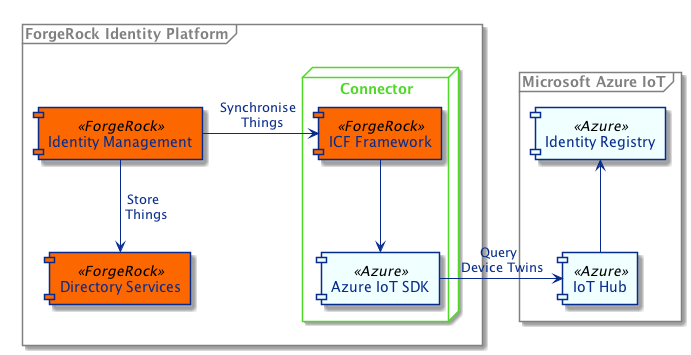
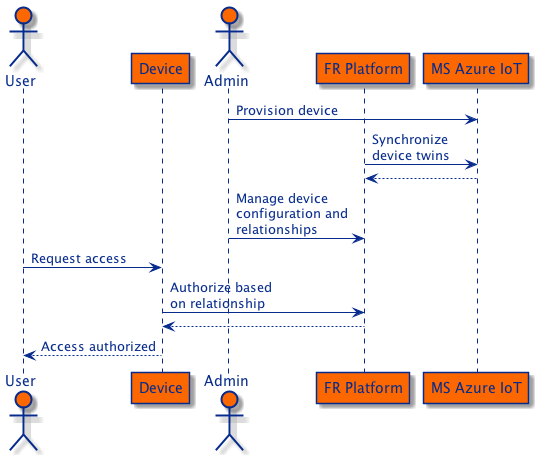

## Azure IoT Integration

The ForgeRock Identity Platform allows you to manage user and thing identities side by side. It offers the ability
to manage relationships between users and things with authorized access based on those relationships. Microsoft's
Azure IoT can be used alongside the ForgeRock Identity Platform if you want to add user and device relationships
to your IoT solution.

The goal of this integration is to prove the aforementioned concept. It uses an
[ICF Connector](https://backstage.forgerock.com/docs/idm/7/connector-reference/) to query device identities in
Azure IoT Hub and synchronize and map them to things in the ForgeRock Platform. The integration is built on top of
[ForgeRock's ForgeOps CDK](https://backstage.forgerock.com/docs/forgeops/7/index-forgeops.html) with added
configuration for [ForgeRock Things](https://backstage.forgerock.com/docs/things/7) and the ICF Connector, integrated
into [ForgeRock Identity Management](https://backstage.forgerock.com/docs/idm/7).

#### Integration Components

The diagram illustrates how the different components interact with each other. The connector uses the ICF Framework
and the Azure IoT SDK to synchronize device identities that exist in the Azure IoT Hub Identity Registry to thing
identities in ForgeRock Directory Services.

Thing identities are stored alongside user identities in the ForgeRock Platform, which allows you to manage
relationships between users and things. These relationships can then be used to authorize access to devices or to the
device's resources.

#### Relationship Management

This diagram illustrates identity synchronization and device management.
 - A device is either dynamically provisioned to the Azure IoT Hub, or manually added by an administrator.
 - Once provisioned, the device identity is automatically synchronized to the ForgeRock Platform.
 - The administrator can then manage relationships between users and devices in the ForgeRock Platform or change the
  device configuration, and it will automatically be synchronized between ForgeRock and Azure.
 - A user may request access to a device or to a device's resources.
 - Access is authorized by the ForgeRock Platform based on the relationship that exists between the user and the device.
 
#### References
- [ICF Connector Developer's Guide](https://backstage.forgerock.com/docs/idm/7/connector-dev-guide/)
- [Get started with device twins](https://docs.microsoft.com/en-us/azure/iot-hub/iot-hub-java-java-twin-getstarted)
- [IoT Hub Query Language](https://docs.microsoft.com/en-us/azure/iot-hub/iot-hub-devguide-query-language)
- [IoT Hub Identity Registry](https://docs.microsoft.com/en-us/azure/iot-hub/iot-hub-devguide-identity-registry)