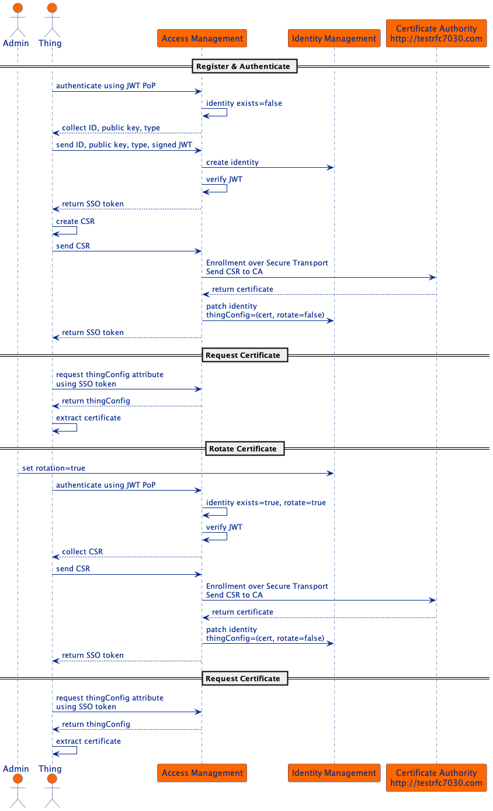
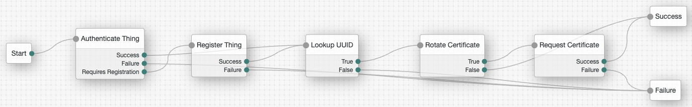
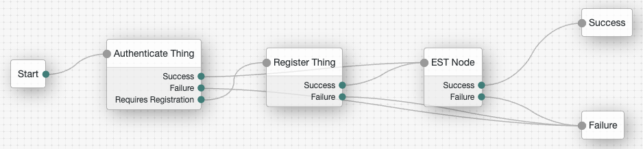

# Certificate Management

The ForgeRock Platform can be configured to manage certificates for things by integrating with a Certificate Authority
(CA) of your choice. This integration example uses the [Enrollment over Secure Transport](http://testrfc7030.com) test
server to demonstrate how a CA can be contacted from an AM authentication script to request a device certificate.
Scripting enables you to do a quick and flexible integration with any service available via HTTP(S). For a more
performant solution a custom authentication node can also be used.

#### Request and Rotate Certificate


The diagram illustrates the sequence of events in this example. It shows how a thing can register and request a
certificate without any human interaction. For simplicity this example registers an untrusted thing. However, by
modifying the authentication tree we can replace dynamic with manual registration to ensure trust during authentication.

After registration and the initial certificate request, a thing's certificate can also be rotated. The certificate may
need to be rotated when it has expired, revoked or manual rotation was requested. This example shows how manual
rotation can be achieved. Certificate expiration and revocation should be managed as instructed by the issuing
certificate authority.

### Implementation Details
This example uses the ForgeRock IoT Solution to register, authenticate, and request a certificate for a thing identity.
The authentication tree is configured to be compatible with the OAuth 2.0 specification.

RegisterThings Tree:



RegisterThingsWithEstNode Tree:


### Run the ForgeRock Platform

*This example requires you to have a high level of familiarity with ForgeOps and the ForgeRock IoT Solution. Contact
ForgeRock for a demonstration of the solution.*

Follow the ForgeOps documentation to install the
[third party software](https://backstage.forgerock.com/docs/forgeops/7.3/cdk/cloud/setup/gke/sw.html) and
[obtain the cluster details](https://backstage.forgerock.com/docs/forgeops/7.3/cdk/cloud/setup/gke/clusterinfo.html).

Set the following environment variables:
```
export PROJECT=<The name of the Google Cloud project that contains the cluster>
export CLUSTER=<The cluster name>
export ZONE=<The Google Cloud zone in which the cluster resides>
export NAMESPACE=<The namespace to use in your cluster>
export FQDN=<The fully qualified domain name of your deployment>
export CONTAINER_REGISTRY=<The default container registry>
export AM_URL=<The URL AM has been deployed to>
```

After installing the Google Cloud SDK, authenticate the SDK:
```
gcloud auth login
```

Deploy the Things CDK to GKE:
```
./deploy.sh
```

### Run example client
The client example will demonstrate how to register and authenticate a thing before requesting and rotating its certificate. 

#### RegisterThings
Run the following commands and follow the onscreen instruction.
```
cd things
docker build -t things .
docker run -e AM_URL=$AM_URL -e TREE="RegisterThings" -it --rm things
```

Expected Outcome:
```
Press Enter to register and authenticate...

--> Register & Authenticate Device-8456232771
--> Registered & Authenticated successfully

Press Enter to request the certificate...

--> Requesting x.509 Certificate
== x.509 Certificate ==
Subject: CN=Device-8456232771
Issuer: CN=estExampleCA
Serial Number: 34836
Validity:
Not Before: <YYYY-MM-DD HH:mm:ss> +0000 UTC
Not After:  <YYYY-MM-DD HH:mm:ss> +0000 UTC

Press Enter to re-authenticate and request the certificate...

--> Authenticate Device-8456232771
--> Authenticated successfully
--> Requesting x.509 Certificate
== x.509 Certificate ==
Subject: CN=Device-8456232771
Issuer: CN=estExampleCA
Serial Number: 34836
Validity:
Not Before: <YYYY-MM-DD HH:mm:ss> +0000 UTC
Not After:  <YYYY-MM-DD HH:mm:ss> +0000 UTC
```
#### RegisterThingsWithEstNode
Navigate to the *RegisterThingsWithEstNode* authentication tree and update the Password attribute in EST Node.

If the device has been previously registered, delete the device's identity (*Device-8456232771*).

Update the TREE environment variable as follows and follow the onscreen instruction.
```
docker run -e AM_URL=$AM_URL -e TREE="RegisterThingsWithEstNode" -it --rm things
```