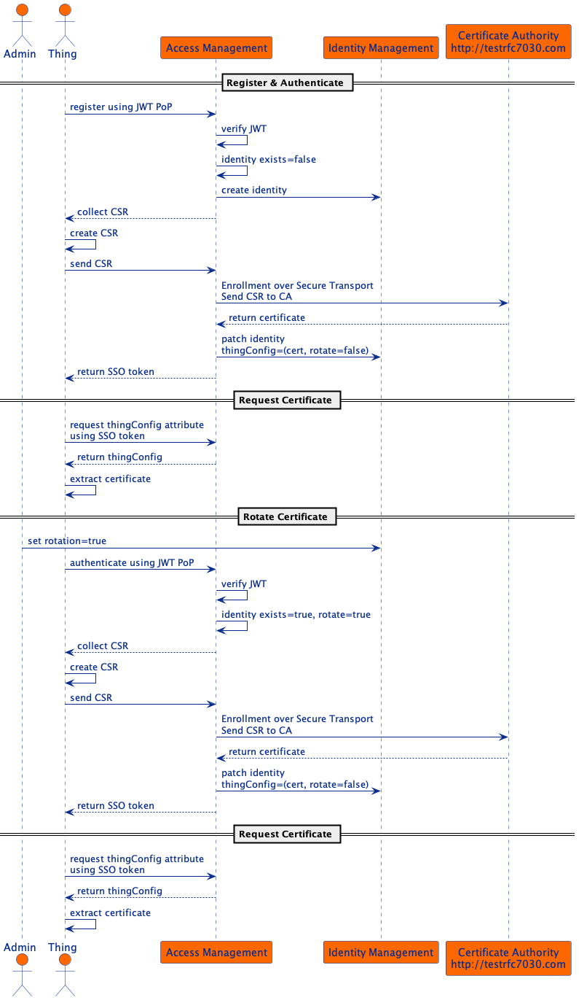

# Certificate Management

The ForgeRock Platform can be configured to manage certificates for things by integrating with a Certificate Authority
(CA) of your choice. This integration example uses the [Enrollment over Secure Transport](http://testrfc7030.com) test
server to demonstrate how a CA can be contacted from an AM authentication script to request a device certificate.
Scripting enables you to do a quick and flexible integration with any service available via HTTP(S). For a more
performant solution a custom authentication node can also be used.

#### Request and Rotate Certificate


The diagram illustrates the sequence of events in this example. It shows how a thing can register and request a
certificate without any human interaction. For simplicity this example registers an untrusted thing. However, by
modifying the authentication tree we can replace dynamic with manual registration to ensure trust during authentication.

After registration and the initial certificate request, a thing's certificate can also be rotated. The certificate may
need to be rotated when it has expired, revoked or manual rotation was requested. This example shows how manual
rotation can be achieved. Certificate expiration and revocation should be managed as instructed by the issuing
certificate authority.

### Run the ForgeRock Platform

Install the third party software by following the instructions in the
[ForgeOps docs](https://backstage.forgerock.com/docs/forgeops/7.1/cdk/minikube/setup/sw.html).
Additionally, install [mkcert](https://github.com/FiloSottile/mkcert) for making locally-trusted development certificates.

Clone this repo:
```
git clone https://github.com/ForgeRock/iot-edge.git
cd iot-edge/examples/proof-of-concept/certificate-management
```

Start the platform:
```
./run.sh
```

In a new terminal, run `minikube ip` and map the output from the command to `iot.iam.example.com` in your hosts file:
```
echo "$(minikube ip) iot.iam.example.com" >> /etc/hosts
```

The connection details for the platform will be printed to the console:
```
=====================================================
URL: https://iot.iam.example.com/platform
Username: amadmin
Password: 6KZjOxJU1xHGWHI0hrQT24Fn
DS Password: zMO2W9IlOronDqrF2MtEha3Jiic3urZM
=====================================================
```

### Run example client
The client example will demonstrate how to register and authenticate a thing before requesting and rotating its certificate.
Run the following commands and follow the onscreen instruction.
```
cd things
docker build -t things .
docker run -it --add-host iot.iam.example.com:$(minikube ip) --rm things
```
