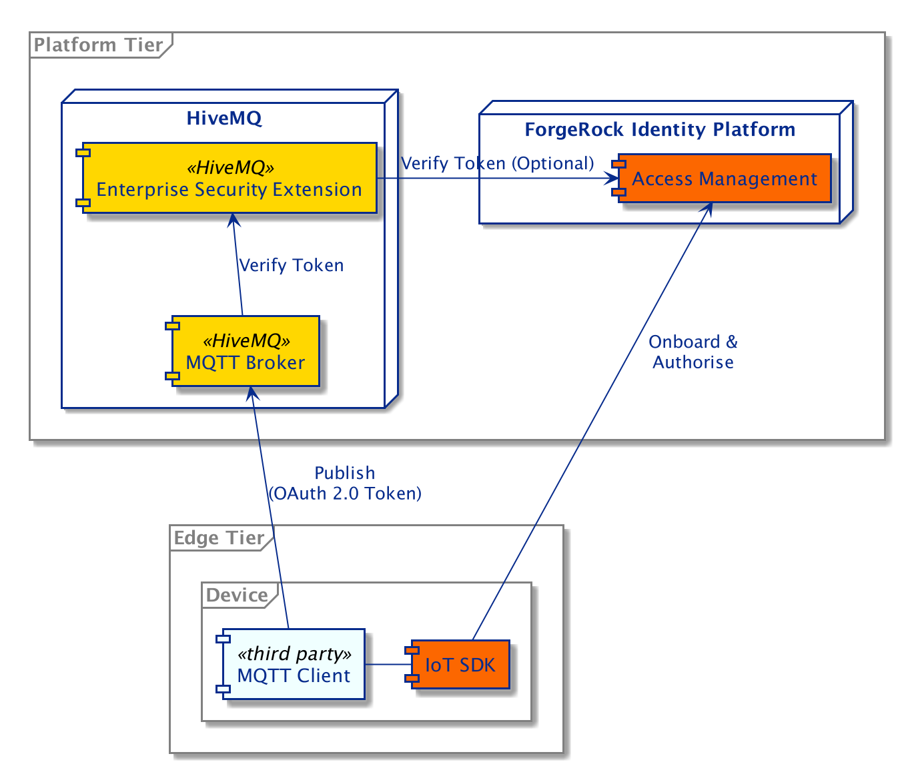
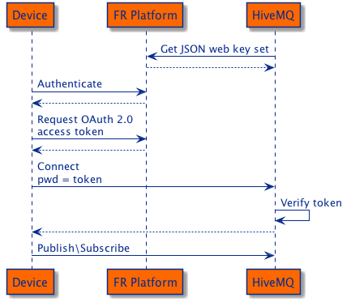

## HiveMQ Integration

The ForgeRock Identity Platform can issue OAuth 2.0 access tokens for authentication and authorization. The
[HiveMQ](https://www.hivemq.com/) Enterprise Security Extension (ESE) supports JSON Web Tokens (JWT) and allows
integration with OAuth 2.0 authorization servers for client authentication.

The goal of this integration is to prove the aforementioned concept. It is built on top of
[ForgeRock's ForgeOps CDK](https://backstage.forgerock.com/docs/forgeops/7/index-forgeops.html) with added
configuration for [ForgeRock IoT](https://backstage.forgerock.com/docs/things/7). It uses the public
[HiveMQ Docker image](https://www.hivemq.com/docs/hivemq/4.4/user-guide/docker.html), which is configured to use the
[Enterprise Security Extension](https://www.hivemq.com/docs/ese/4.4/enterprise-security-extension/ese-getting-started.html).

### Integration Components



The diagram illustrates how the different components interact with each other. The device client application
communicates directly with the ForgeRock Platform and HiveMQ in order to authenticate, authorize and publish data.

### Authentication and Authorization



The diagram shows an example authentication and authorization flow.
 - Using the IoT SDK, the device registers and authenticates itself with the ForgeRock Platform.
 - It then requests an OAuth 2.0 access token with the `publish` and `subscribe` scopes.
 - The ForgeRock IoT Service has been configured to use the external `uid` as the OAuth 2.0 Subject Attribute (`sub` claim).
 - The device then connects to HiveMQ using MQTT, with its `uid` as the MQTT client ID and the OAuth 2.0 access token as the connection password.
 - HiveMQ ESE authenticates the device by verifying the OAuth 2.0 access token and has been configured to perform the following checks:
    - The signature is validated locally with the JSON web keys downloaded from the ForgeRock Platform.
    - The list of scopes contains `publish` and `subscribe`.
    - The subject (`sub` claim) matches the MQTT client ID.

   Additional access token verification can be done via configuration of the
   [HiveMQ ESE](https://www.hivemq.com/docs/ese/4.4/enterprise-security-extension/ese.html#jwt).

### Using the Platform directly

To run the example from the command line requires a MQTT client.
This example uses [mosquitto_pub](https://mosquitto.org/man/mosquitto_pub-1.html) but any client can be used.

Create a thing identity with name `thingymabot` and password `5tr0ngG3n3r@ted` via the platform UI as described in the forgrops
[README](../../../deployments/forgeops/README.md#using-the-platform-for-things). Then authenticate `thingymabot`:
```
curl --request POST 'https://iot.iam.example.com/am/json/realms/root/authenticate?realm=/' \
    --header 'Content-Type: application/json' \
    --header 'X-OpenAM-Username: thingymabot' \
    --header 'X-OpenAM-Password: 5tr0ngG3n3r@ted' \
    --header 'Accept-API-Version: resource=2.0, protocol=1.0'
```

Save the `tokenId` received from this request to a variable:
```
export thingTokenId=FJo9Rl....AAIwMQ..*
```

With this session token, `thingymabot` can request an OAuth 2.0 access token from the `things` endpoint:
```
curl --request POST 'https://iot.iam.example.com/am/json/things/*?_action=get_access_token' \
    --header 'Accept-API-Version: protocol=2.0,resource=1.0' \
    --header 'Content-Type: application/json' \
    --header "Cookie: iPlanetDirectoryPro=${thingTokenId}" \
    --data-raw '{
        "scope":["publish", "subscribe"]
    }'
```

Save the `access_token` received from this request to a variable:
```
export accessToken=eyJ0eX....OWyvLA
```

Then publish a message to the HiveMQ server with the MQTT client, using `thingymabot` as the ID for the client and the access token as the `password`.
For example, the following will publish ten messages, 2 seconds apart:
```
for run in {1..10}; do
    message="Time now is $(date -u +'%Y-%m-%dT%H:%M:%SZ')"
    mosquitto_pub -t test -i thingymabot -u thingymabot -P "${accessToken}" -m "${message}" || break
    echo "message \"$message\" sent"
    sleep 2
done
```

### Using the SDK

The [mqtt-client](./mqtt-client) folder contains an example that uses the ForgeRock IoT Golang SDK.
The example uses a certificate and the SDK to dynamically register a thing identity in the ForgeRock Platform so manual registration of an identity is not required.

To run the example:
```
docker exec -it mqtt-client bash -c mqtt-client
```
