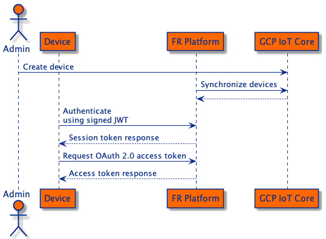
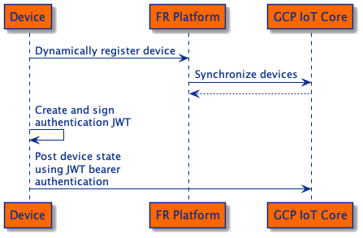

# IoT Demos

## Deploy ForgeOps IoT

This will deploy Version 7.1.0 of the ForgeOps CDK, configured for IoT, to Google Kubernetes Engine.

Follow the ForgeOps documentation to install the
[third party software](https://backstage.forgerock.com/docs/forgeops/7.1/cdk/cloud/setup/gke/sw.html) and
[obtain the GKE cluster details](https://backstage.forgerock.com/docs/forgeops/7.1/cdk/cloud/setup/gke/clusterinfo.html).

Set the following environment variables:
```
PROJECT     - The name of the Google Cloud project that contains the cluster
CLUSTER     - The cluster name
ZONE        - The Google Cloud zone in which the cluster resides
NAMESPACE   - The namespace to use in your cluster
FQDN        - The fully qualified domain name of your deployment
```

for example:
```
export PROJECT=fr-iot-demos
export CLUSTER=forgerock
export ZONE=us-east1
export NAMESPACE=iot-demo
export FQDN=example.forgeops.com
```

After installing the Google Cloud SDK, authenticate and configure the SDK:
```
gcloud auth login
gcloud container clusters get-credentials $CLUSTER --zone $ZONE --project $PROJECT
```

Clone the IoT repository and checkout the demo branch:
```
git clone https://github.com/ForgeRock/iot-edge.git
cd iot-edge
git checkout iot-demos
```

Deploy the ForgeOps IoT platform:
```
./deploy.sh
```

The deployment script will perform the following tasks:
 - Checkout the ForgeOps and ForgeRock IoT Git repositories
 - Apply the IoT LDAP schema for Things to DS
 - Configure AM:
   - with IoT identity repository objects and attributes
   - as an OAuth 2.0 Authorization Server
   - with the secrets required for IoT dynamic registration and OAuth 2.0 features
 - Configure IDM:
   - with the Thing managed object schema
   - for User and Thing relationships
 - Create the Kubernetes namespace and deploy the platform with Scaffold

When the script is complete it will print out the connection details for the platform.

## Prepare Device Environment
 
Get the Go docker image:
```
docker pull golang
```

Set the environment variable for the AM URL:
```
export AM_URL=https://$FQDN/am
```

Start the Go docker image to simulate a smart device:
```
cd examples/proof-of-concept/iot-demos
docker run -it -e AM_URL="$AM_URL" -v "$PWD"/things:/usr/src/things -w /usr/src/things golang
```

## Populate Demo Identities

Use the `(uid=admin user)` password provided at the end of the deployment script and populate the demo identities,
for example:
```
./add-identities.sh zIg1LChqItAh7imtQSopLxn5uGlnMycc
```

## Use case 1

Provisioning new smart devices manually and dynamically into the ForgeRock platform.

### Manual Registration

Configure the platform:
 - Create the IoT Service (Access Management Native Console)
 - Create a new Journey:
   - Name: `iot-journey`
   - Identity Object: `Things`
   - Nodes: `Authenticate Thing`
 - Create an identity for the smart device:
   - ID: `manual-smart-device`
   - Type: `device`
   - Keys: `{"keys":[{"use":"sig","kty":"EC","kid":"cbnztC8J_l2feNf0aTFBDDQJuvrd2JbLPoOAxHR2N8o=","crv":"P-256","alg":"ES256","x":"wjC9kMzwIeXNn6lsjdqplcq9aCWpAOZ0af1_yruCcJ4","y":"ihIziCymBnU8W8m5zx69DsQr0sWDiXsDMq04lBmfEHw"}]}`

#### Build and Run

Run the `manual-registration` example to authenticate the device:
```
go run ./cmd/manual-registration -url "$AM_URL"
```

### Dynamic Registration

Configure the platform:
 - Modify `iot-journey` to include the `Register Thing` node
 - Select `Create Identity`
 - Add the following attributes:
   - `sub` : `uid`
   - `thingType` : `thingType`
   - `thingProperties` : `thingProperties`

#### Build and Run

Run the `dynamic-registration` example to dynamically register the device:
```
go run ./cmd/dynamic-registration -url "$AM_URL"
```

## Use case 2

Managing device identities in a central location along with user and service identities.

### Manage identities

Create user, device and service identities as required.

Identities can be modified and deleted through the Identities UI.

Relationships can be created between users and things. These relationships can then be queried and used, for example,
to manage access to user data or restrict user access to devices or services. Relationships can be created manually
through the UI or dynamically via custom endpoints.

## Use case 3

Manage user access to a particular device.

### Group based access

This use case will use a feature called [Dynamic OAuth 2.0 Authorization](https://backstage.forgerock.com/docs/am/7.1/authorization-guide/oauth2-authorization.html)
to assign OAuth 2.0 scopes to users based on what group they belong to. This allows devices to restrict access to users
if they are not in a particular group.

The device will obtain an access token for the user via the OAuth 2.0 Device Authorization Grant (Device Flow). This
means that the user does not have to share their credentials with the device and the device does not need an interactive
user interface.

Configure the platform:
- Modify the IoT Service to add OAuth 2.0 client
  - Add `view` and `maintain` scopes to the client
- Create groups for `Healthcare Professionals` and `Technicians`
- Add users to each group

Policies for making the decision about which scopes to add to the user's access token has already been added to the
configuration.

Run the `device-access` example to authenticate the user and gain access to the device:
```
go run ./cmd/device-access -url "$AM_URL"
```

Navigate to the URL provided and authenticate the user that requires access to the device.

The device will receive an access token for the user and inspect the scopes to decide what type of access the user is allowed.


## Use case 4

Integrate with Google Cloud Platform IoT Core and manage devices in either ForgeRock or GCP.

### Synchronise devices with ForgeRock Identity Management

Deploy the ForgeRock Platform from the
[Google Cloud Platform IoT Core Integration](https://github.com/ForgeRock/iot-edge/tree/main/examples/proof-of-concept/gcp-iot).

Create GCP registry and populate with devices.

Configure the platform:
- Ensure Reconciliation from GCP to FR is enabled
- Add the GCP IoT Connector in IDM

View the newly synchronised devices in the ForgeRock Platform.

### Authenticate and authorize existing device

The device's public key is synchronised to the ForgeRock Platform, which means that the device can now authenticate
with ForgeRock to access additional features.

The device can now request an OAuth 2.0 access token, which can be used to access 3rd party services.

 

Run the `device-authorize` example to authenticate the device and to request an access token:
```
go run ./cmd/device-authorize -url "$AM_URL" -tree RegisterThings -name 2698309725841565 -keyid 2698309725841565-0
```

Access tokens can be issued as JWTs to allow services to do their own verification and access additional claims. 

### Register new devices and publish device telemetry

Devices can be dynamically registered in the ForgeRock Platform and synchronised to the GCP Registry.



Configure the platform:
- Disable Reconciliation from GCP to FR
- Enable Reconciliation from FR to GCP

Run the `gcp-iot` example to register a device and publish device telemetry to GCP:
```
go run cmd/gcp-iot/main.go --url "$AM_URL" -p iec-engineering -l us-central1 -r things -n dynamic-gcp-device
```

View the device's state in GCP IoT Core.