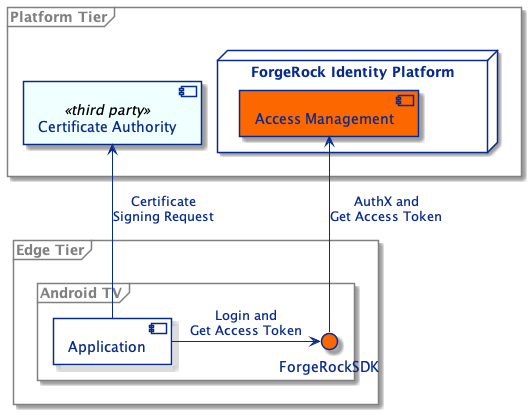
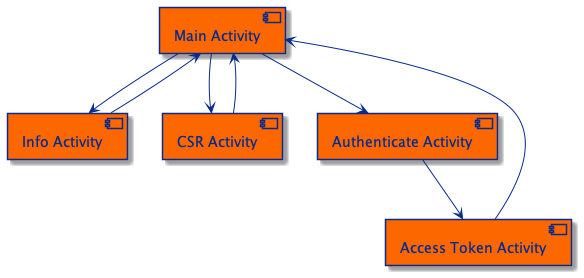
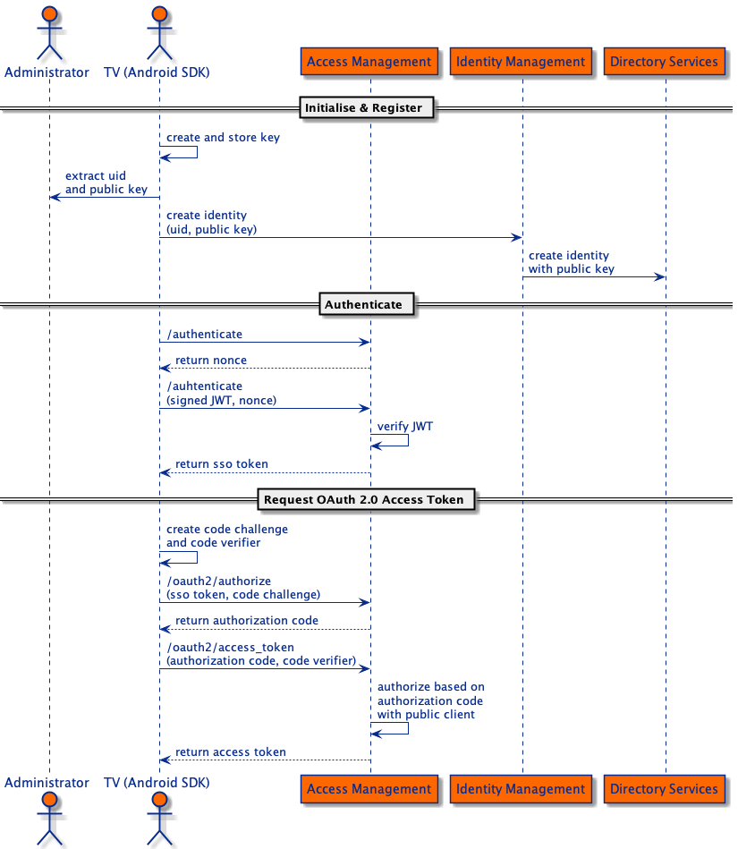
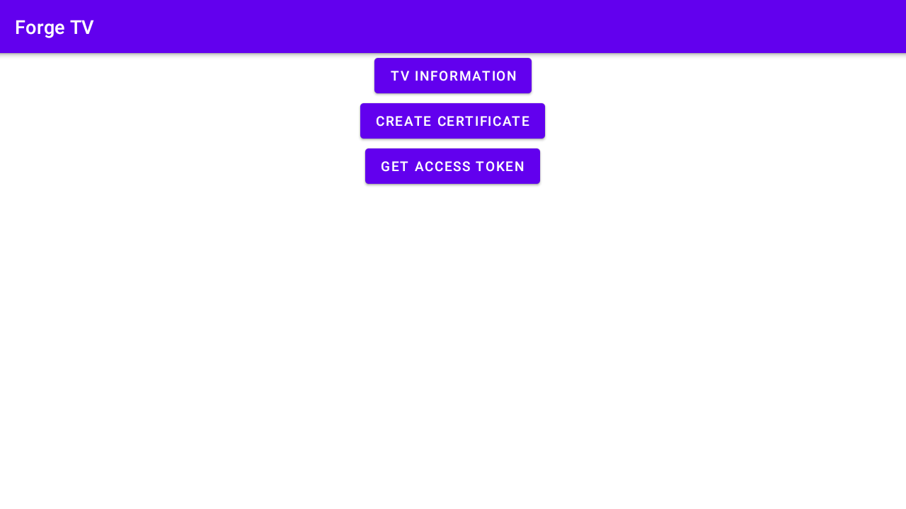
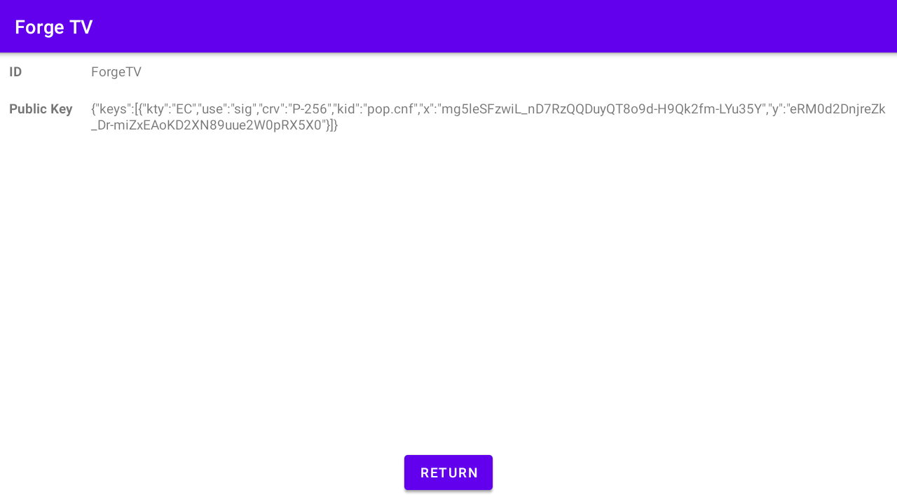
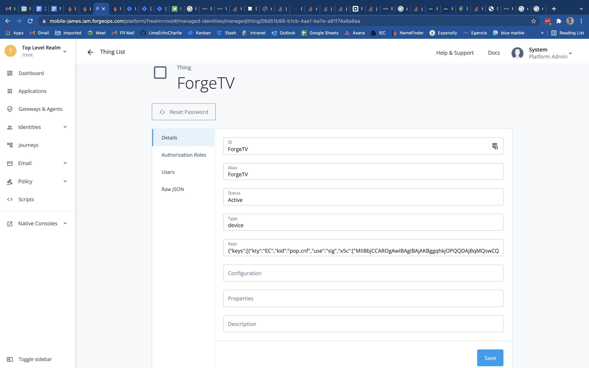
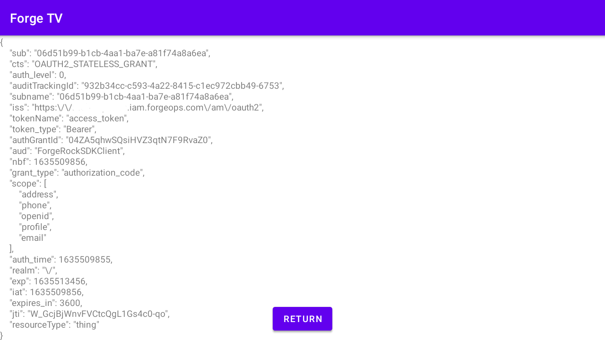
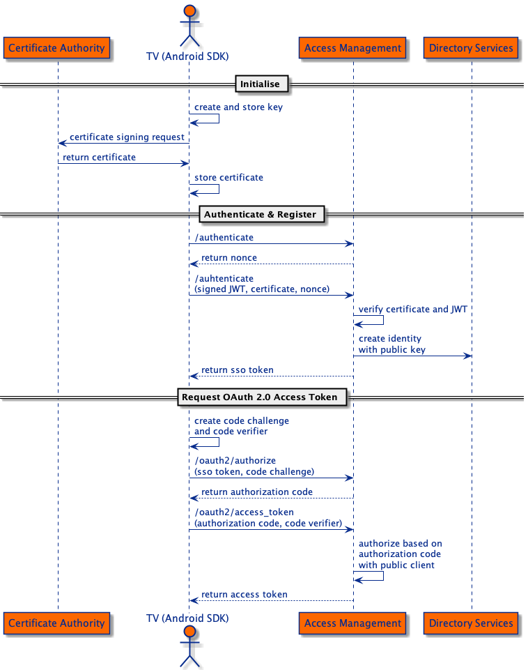
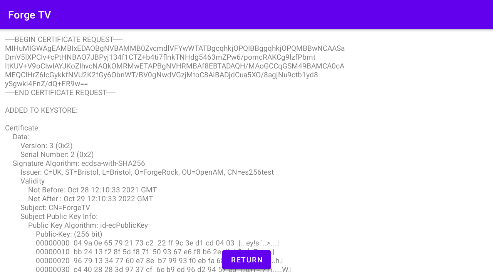
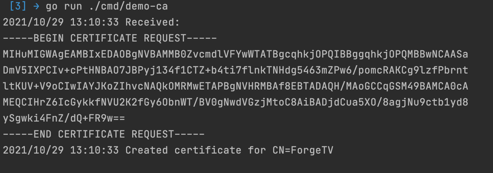

## Mobile SDK

ForgeRock provides an Android SDK to enable developers to quickly leverage Intelligant Access in ForgeRock's Access Management product.

The goal of this integration is to show how the IoT Authenication Tree nodes can be combined with the Android SDK to enable
a device to authenticate itself and obtain an OAuth 2.0 access token. It is built on top of
[ForgeRock's ForgeOps CDK](https://backstage.forgerock.com/docs/forgeops/7/index-forgeops.html) that is deployed to GCP
with added configuration for [ForgeRock IoT](https://backstage.forgerock.com/docs/things/7). It uses the open source 
[ForgeRock Android SDK](https://github.com/ForgeRock/forgerock-android-sdk).

### Integration Components



The diagram illustrates how the different components interact with each other. The Android application that is running on an Android TV 
communicates with the ForgeRock Platform via the Android SDK in order to authenticate, authorize and obtain an OAuth 2.0 access token.
The Android App supports both manual and dynamic registration. 
In dynamic registration, the Certificate Authority is mocked by a local Golang server.

### App Design



The diagram shows the App architecture. 
 - The Main Activity acts as the App landing page.
 - The Info Activity displays the device name and public key for manual registration.
 - The CSR Activity creates a Certificate Signing Request, sends it to the Certificate Authority and saves the returned certificate in the keystore.
 - The Authenticate Activity authenticates the device with AM.
 - The Access Token Activity requests an OAuth 2.0 access token from AM.

### Running the App

Open the ./forgetv directory in Android Studio. Modify the string resources under AM Instance Details in the `strings.xml` file to match the AM deployment, for example:

```
<!-- AM Instance Details -->
<string name="forgerock_url" translatable="false">https://iot.iam.forgeops.com/am</string>
<string name="forgerock_cookie_name" translatable="false">iPlanetDirectoryPro</string>
<string name="forgerock_realm" translatable="false">root</string>
```

Download an Android TV emulator and run the `app` on the emulator.

In a terminal, run the dummy certificate authority server:
```
go run ./cmd/demo-ca
```
Your OS may ask permission to allow `demo-ca` to accept incoming network connections, select `Allow`.

#### Manual Registration



The diagram shows the manual registration flow.
 - On startup, the App creates an asymmetric keypair in its keystore if one hasn't been created already.
 
 - Select `TV INFORMATION` to display the TV's name and public key (in a JWK set format).

 - The adminstrator creates a Thing identity in AM, using the name and public key provided by the App.
 
 - Returning to the landing page and selecting `GET ACCESS TOKEN` will authenticate, authorise and request an OAuth 2.0 access token. This is all handled by the ForgeRock Android SDK and custom callback handlers.
 


#### Dynamic Registration



The diagram shows the dynamic registration flow.
 - On startup, the App creates an asymmetric keypair in its keystore if one hasn't been created already.
 
 - Select `CREATE CERTIFICATE` to instruct the App to use its keypair to create a Certificate Signing Request and send it to the Certificate Authority to sign. The App saves the certificate it receives from the CA in its keystore.

 The CA logs shows this interaction from the dummy CA server side.

 - Returning to the landing page and selecting `GET ACCESS TOKEN` will authenticate, authorise and request an OAuth 2.0 access token. This is all handled by the ForgeRock Android SDK and custom callback handlers.
 
 - If the TV is unknown to AM, the Register Thing node will request a certificate from the App when the App authenticates with AM for the first time. If the certificate is valid and signed by a key known by AM, the Register Thing node will register the device in AM.
 