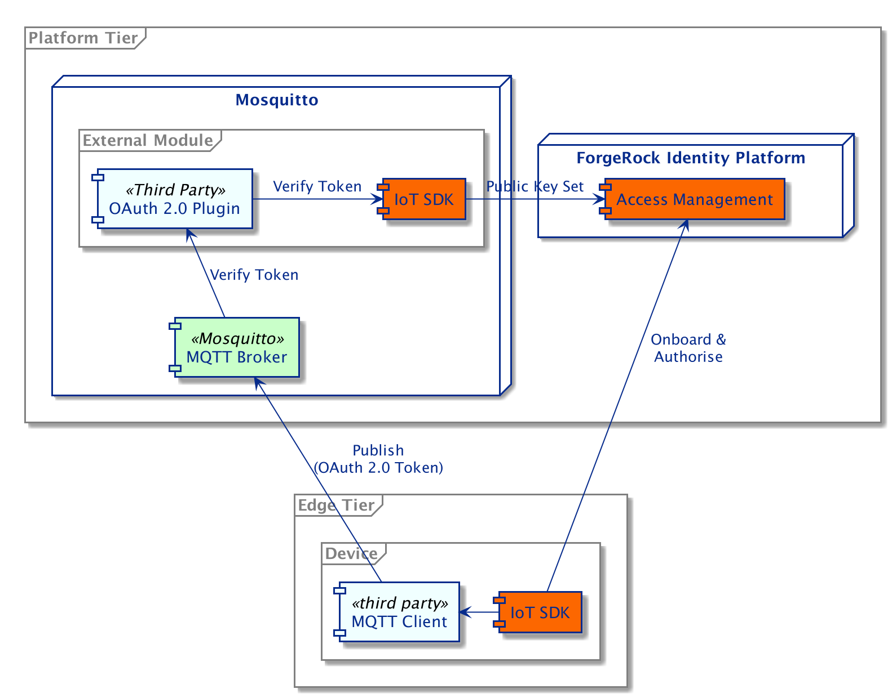

## Mosquitto Proof of Concept

The ForgeRock Platform can provide authentication and authorisation for third party products, 
removing the need for these products to internally manage IoT identities.

This PoC illustrates how access control within the [Mosquitto](https://mosquitto.org/) message broker can be delegated to the ForgeRock platform,
ensuring that only authenticated things can publish or subscribe to authorised topics.
The PoC is built on top of
[ForgeRock's ForgeOps CDK](https://backstage.forgerock.com/docs/forgeops/7/index-forgeops.html) with added
configuration for [ForgeRock IoT](https://backstage.forgerock.com/docs/things/7).
Mosquitto is configured to use an external module for authentication and access control.
This example module uses the ForgeRock IoT SDK to provide OAuth 2.0 access token authorisation.

#### Integrated Components



The diagram illustrates how the different components interact with each other.

#### Authentication and Authorisation flow


The diagram shows a example authentication and authorisation flow.
The Auth 2.0 access token can be reused until it expires, 
when the device would have to re-authenticate with AM to retrieve another token. 

#### Thing Publisher Example
In a terminal, navigate to this directory and call the run script:

```
./run.sh
```

This will run an IoT enabled CDK and put up a Mosquitto server and a things container. 

Run the Thing Publisher example by running:

```
docker exec -it things go run mosquitto-demo/thing-pub
```

The messages from the Thing can be read from the terminal by using a MQTT command line client and the `admin` user:

* username: `admin`
* password: `password`
* port: `1884`

For example:
```
mosquitto_sub -u admin -P password -t test -p 1884
```
