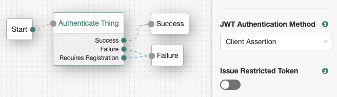
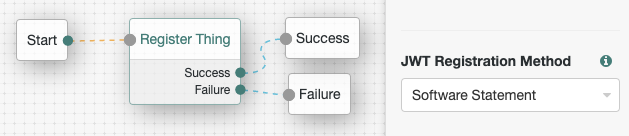

# Standard OAuth 2.0 API with ForgeRock IoT Solution

The ForgeRock IoT solution offers registration, authentication and authorization features for things. Although it uses
standard specifications for all features, it does not use a standard API for accessing them. This example demonstrates
how an API Gateway can be used to provide things with a standard API.


The diagram illustrates how a thing can make standard OAuth 2.0 API requests via an API Gateway and interact with the
ForgeRock IoT solution.

OAuth 2.0 Dynamic Registration: 
- The thing is prepared with a [Software Statement](https://datatracker.ietf.org/doc/html/rfc7591#section-2.3) that
  contains the thing's public key.
- The thing makes a standard [OAuth 2.0 Dynamic Registration](https://datatracker.ietf.org/doc/html/rfc7591) request,
  using only the software statement.
- The API Gateway rewrites the request into the format expected by AM's authentication endpoint for thing registration.
- AM creates an identity for the thing with a unique identifier and responds with a session token.
- The API Gateway uses the session token to
  [request the thing's unique identifier](https://github.com/ForgeRock/iot-edge/blob/main/docs/things-endpoint.md#get-the-attributes-of-a-thing)
  and returns it to the thing as it's OAuth 2.0 Client ID.

OAuth 2.0 Client Credential Grant with JWT Bearer Auth:
- The thing makes a standard OAuth 2.0 access token request using the
  [Client Credentials Grant](https://backstage.forgerock.com/docs/am/7.1/oauth2-guide/oauth2-client-cred-grant.html)
  and a [JWT Bearer Token for client authentication](https://backstage.forgerock.com/docs/am/7.1/oauth2-guide/client-auth-jwt.html).
- The API Gateway rewrites the request into the format expected by the AM's authentication endpoint for thing authentication.
- AM verifies the Bearer JWT and responds with a session token.
- The API Gateway uses the session token to
  [request and access token for the thing](https://github.com/ForgeRock/iot-edge/blob/main/docs/things-endpoint.md#obtain-an-oauth-20-access-token)
  and returns it to the thing.

OpenID Connect User Info:
- The thing uses the access token to request the authorized claims using the OIDC User Info endpoint.
- The API Gateway forwards the request to AM unchanged and receives the claims, which it then returns to the thing.

## Implementation details

This example uses the ForgeRock IoT Solution to register, authenticate and request attributes for a thing identity.
The registration and authentication trees are configured to be compatible with the OAuth 2.0 specification.

Registration Tree:



Authentication Tree:



The example uses REST API calls rather than the IoT SDK as demonstrated by the [Access Token script](access-token.sh).

## Deploy and Run

*This example requires you to have a high level of familiarity with ForgeOps and the ForgeRock IoT Solution. Contact
ForgeRock for a demonstration of the solution.*

Follow the ForgeOps documentation to install the
[third party software](https://backstage.forgerock.com/docs/forgeops/7.2/cdk/cloud/setup/gke/sw.html) and
[obtain the cluster details](https://backstage.forgerock.com/docs/forgeops/7.2/cdk/cloud/setup/gke/clusterinfo.html).

Set the following environment variables:
```
export PROJECT=<The name of the Google Cloud project that contains the cluster>
export CLUSTER=<The cluster name>
export ZONE=<The Google Cloud zone in which the cluster resides>
export NAMESPACE=<The namespace to use in your cluster>
export FQDN=<The fully qualified domain name of your deployment>
export CONTAINER_REGISTRY=<The default container registry>
export AM_URL=<The URL AM has been deployed to>
export IG_URL=<The URL IG has been deployed to>
```

After installing the Google Cloud SDK, authenticate the SDK:
```
gcloud auth login
```

Deploy the Things CDK to GKE:
```
./deploy.sh
```

Request the Access Token:
```
./access-token.sh
```

Expected Outcome:
```
AM_URL: <AM_URL>
IG_URL: <IG_URL>
---
Software statement:
<software_statement>
---
OAuth 2.0 Dynamic Registration response:
{"thingConfig":["{ \"connection-details\": { \"host\": \"https://example.com\", \"port\": 8080, \"auth\": \"bearer\" } }"],"client_id":"<client_id>"}
---
OAuth 2.0 client assertion:
<client_assertion>
---
OAuth 2.0 Access Token response:
{"access_token":"<access_token>","refresh_token":"<refresh_token>","scope":"thingConfig fr:idm:*","token_type":"Bearer","expires_in":3599}
---
OAuth User Info response:
{"thingConfig":"{ \"connection-details\": { \"host\": \"https://example.com\", \"port\": 8080, \"auth\": \"bearer\" } }","sub":"<sub>","subname":"<subname>"}
```