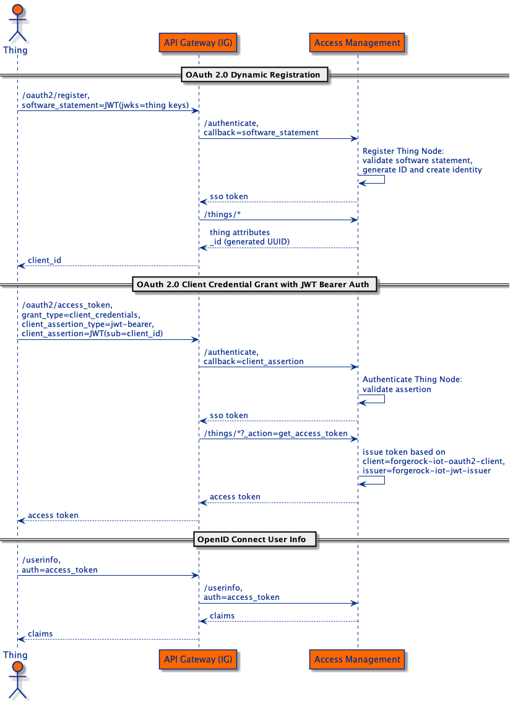
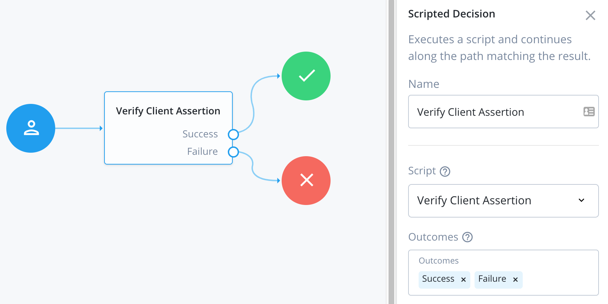

# Standard OAuth 2.0 API with ForgeRock IoT Solution

The ForgeRock IoT solution offers registration, authentication and authorization features for things. Although it uses
standard specifications for all features, it does not use a standard API for accessing them. This example demonstrates
how an API Gateway can be used to provide things with a standard API.



The diagram illustrates how a thing can make standard OAuth 2.0 API requests via an API Gateway and interact with the
ForgeRock IoT solution:
- The thing identity is added manually by the manufacturer and the thing's public is provided for verification purposes. 
- The thing makes a standard OAuth 2.0 access token request using the [Client Credentials Grant](https://backstage.forgerock.com/docs/am/7.1/oauth2-guide/oauth2-client-cred-grant.html)
  and a [JWT Bearer Token for client authentication](https://backstage.forgerock.com/docs/am/7.1/oauth2-guide/client-auth-jwt.html).
- The API Gateway rewrites the request into the format expected by the AM's authentication endpoint.
- The Bearer JWT is verified in a scripted authentication node and an SSO Token is issued.
- The API Gateway uses the SSO Token to [request and access token from the things endpoint](https://github.com/ForgeRock/iot-edge/blob/main/docs/things-endpoint.md#obtain-an-oauth-20-access-token).
- The thing can then use the access token to request its attributes from IDM or publish data to an MQTT Broker.

## Implementation details

The JWT Bearer Token for client authentication is outlined in [rfc7523](https://datatracker.ietf.org/doc/html/rfc7523#section-3).
In this example we include the ID of the signing key in the header of the JWT. See the
[example application](things/cmd/jwt-bearer-token/main.go) that builds the bearer JWT.

The bearer JWT verification is done in the [Verify Client Assertion script](forgeops/overlay/config/7.0/cdk/am/config/services/realm/root/scriptingservice/1.0/organizationconfig/default/scriptconfigurations/VerifyClientAssertion.groovy),
which is written in Groovy. The authentication journey shown below simply includes a single node using the script.



The [Access Token script](access-token.sh) outlines the API calls made in this example.

## Deploy and Run

*This example requires you to have a high level of familiarity with ForgeOps and the ForgeRock IoT Solution. Contact
ForgeRock for a demonstration of the solution.*

Follow the instructions in the [ForgeOps docs](https://backstage.forgerock.com/docs/forgeops/7.1/cdk/cloud/setup/gke/gke-setup.html)
to prepare your environment. In the `deploy.sh` script, change the values of the `CLUSTER`, `ZONE` and `PROJECT` variables
to the values in your own environment.

Replace the namespace and FQDN in the following instructions.

(Re)Deploy the Things CDK to GKE:
```
./deploy.sh my-namespace dev.example.com
```

Request the Access Token:
```
./access-token.sh dev.example.com
```
